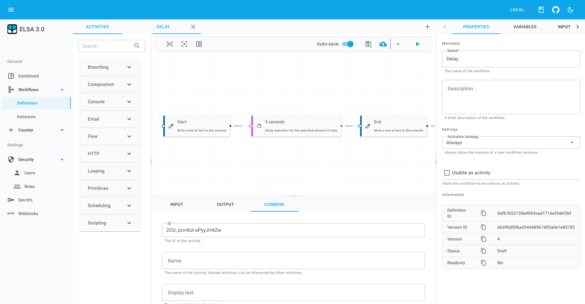

# Elsa Studio

<a href="./artwork/screenshot-1.png" target="_blank">
  <p align="center">
    
  </p>
</a>

[](https://www.nuget.org/packages/Elsa.Studio/)
[](https://github.com/elsa-workflows/elsa-studio/actions/workflows/packages.yml)
[](https://discord.gg/hhChk5H472)
[]( http://stackoverflow.com/questions/tagged/elsa-workflows )
[](https://hosted.weblate.org/engage/elsa-studio/)

Elsa Studio is a modular, extensible application framework built with MudBlazor and is used to manage Elsa workflows and related entities.

## 🆕 New: Shadow DOM Support

Elsa Studio now supports Shadow DOM for complete style isolation when embedding as custom elements! This prevents style conflicts between host applications and Elsa Studio components.

```html
<!-- Regular custom element (may have style conflicts) -->
<elsa-workflow-definition-editor definition-id="my-workflow"></elsa-workflow-definition-editor>

<!-- Shadow DOM custom element (fully isolated styles) -->
<elsa-workflow-definition-editor-shadow definition-id="my-workflow"></elsa-workflow-definition-editor-shadow>
```

[📚 Learn more about Shadow DOM support](./docs/SHADOW_DOM.md)

## Prerequisites

- **.NET SDK**: Ensure you have both [.NET 8](https://dotnet.microsoft.com/download/dotnet/8.0) and [.NET 9](https://dotnet.microsoft.com/download/dotnet/9.0) SDKs installed.
- **Node.js and npm**: Install [Node.js](https://nodejs.org/) (which includes npm) for the frontend tooling.

## Setup

1. **Clone the repository**: `git clone https://github.com/elsa-workflows/elsa-studio.git`
2. **Navigate to the project directory**: `cd elsa-studio`

## Before you build

There are some assets that require `NPM` to build the assets prior to the project building. These have been configured to use an MSBUILD pre-build step and should not require any extra
steps but should you run into any issues or want to build these ahead of time, take the following steps

1. **Navigate to ClientLib folder in Elsa.Studio.DomInterop**: `cd .\src\framework\Elsa.Studio.DomInterop\ClientLib`
1. **Get `NPM` ready to run**: `npm install`
1. **Build the assets**: `npm run build`
1. **Navigate to ClientLib folder in Elsa.Studio.Workflows.Designer**: `cd .\src\modules\Elsa.Studio.Workflows.Designer\ClientLib`
1. **Get `NPM` ready to run**: `npm install`
1. **Build the assets**: `npm run build`

## Build and Run

1. **Restore .NET dependencies**: `dotnet restore Elsa.Studio.sln`
1. **Build the project**: `dotnet build Elsa.Studio.sln`
1. **For Blazor Server Host**: `dotnet run --project .\src\hosts\Elsa.Studio.Host.Server\Elsa.Studio.Host.Server.csproj `
1. **For Blazor Server WASM**: `dotnet run --project .\src\hosts\Elsa.Studio.Host.Wasm\Elsa.Studio.Host.Wasm.csproj`

## Custom Elements & Shadow DOM

The Custom Elements host provides web components that can be embedded in any web application:

1. **For Custom Elements Host**: `dotnet run --project .\src\hosts\Elsa.Studio.Host.CustomElements\Elsa.Studio.Host.CustomElements.csproj --framework net8.0`

### Available Custom Elements

| Component | Regular Element | Shadow DOM Element |
|-----------|-----------------|-------------------|
| Backend Provider | `elsa-backend-provider` | `elsa-backend-provider-shadow` |
| Workflow Definition Editor | `elsa-workflow-definition-editor` | `elsa-workflow-definition-editor-shadow` |
| Workflow Instance Viewer | `elsa-workflow-instance-viewer` | `elsa-workflow-instance-viewer-shadow` |
| Workflow Instance List | `elsa-workflow-instance-list` | `elsa-workflow-instance-list-shadow` |
| Workflow Definition List | `elsa-workflow-definition-list` | `elsa-workflow-definition-list-shadow` |

### Enabling Shadow DOM

Configure Shadow DOM support in `appsettings.json`:

```json
{
  "ShadowDOM": {
    "Enabled": true
  }
}
```

## Framework Integration

Elsa Studio custom elements work seamlessly with modern frameworks:

- **Angular**: Use as regular custom elements in templates
- **React**: Integrate with `useRef` and event handlers  
- **Vue.js**: Use with standard Vue component patterns
- **Vanilla JS**: Create and manage dynamically

See the [framework integration examples](./src/hosts/Elsa.Studio.Host.CustomElements/wwwroot/framework-integration-demo.html) for detailed implementation patterns.

Explore the [Elsa Studio GitHub repository](https://github.com/elsa-workflows/elsa-studio) for more detailed information.

## Localization

Elsa Studio is translated using [Weblate](https://hosted.weblate.org/engage/elsa-studio/)

<a href="https://hosted.weblate.org/engage/elsa-studio/">

</a>
